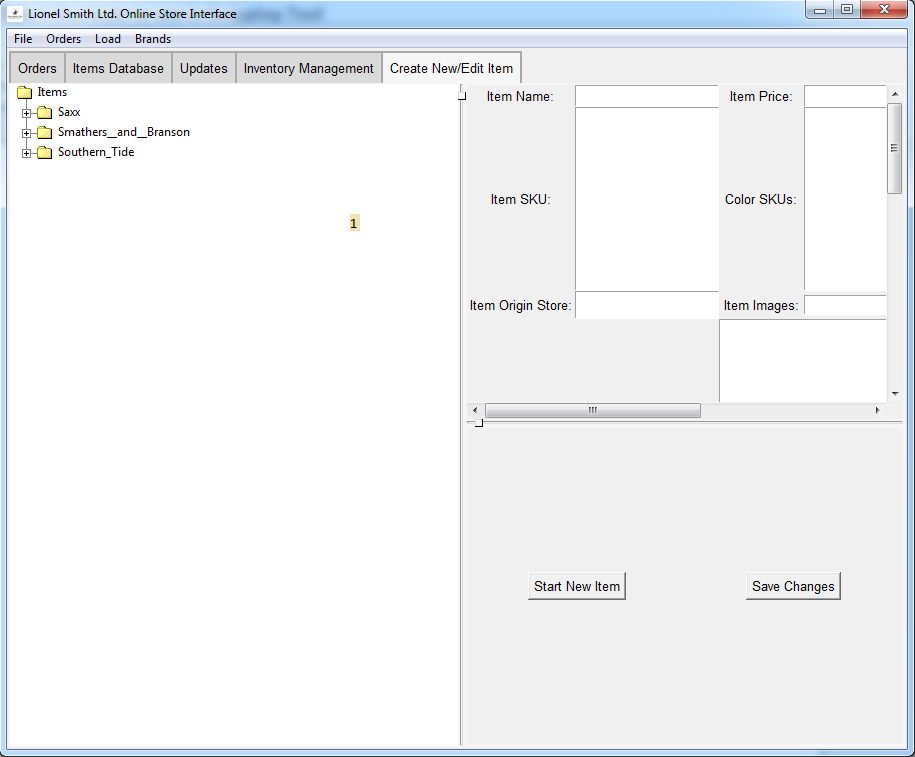
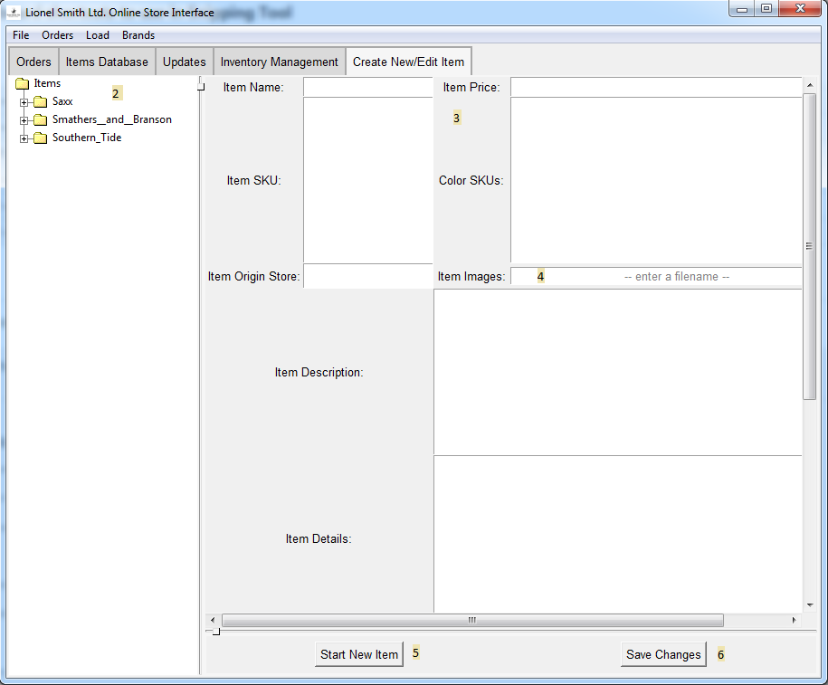
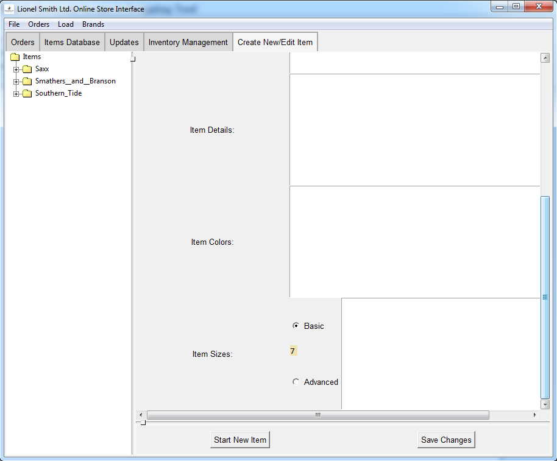

# Create/Edit Items Page

1. The Item Tree

    This is the initial view of the item tree on this page, it's
    advised that you resize the interface so that it looks like 
    the following images

2. The Resized Item Tree

3. Data Entry fields

    For the sake of remaining concise, the details of each field
    won't be discussed here, as each is labelled accordingly
    
4. Picture Entry Field

    An exception to the above, this field will bring up a 
    dialog box to select images to use as the images for an
    item
    
5. Start New Item Button

    This button clears all fields and disassociates them with
    any current item, thus allowing the user to create an 
    entirely new item
    
6. Save Changes

    Saves changes made here to the local data, note that this is
    not immediately uploaded/updated to the online storefront

7. Size Entry

    Another exception, this entry allows for 2 size types, simple
    and advanced, where simple is a single-field size entry 
    (S, M, L, etc.) and advanced is a two-field or more entry
    (pant sizes, etc.)