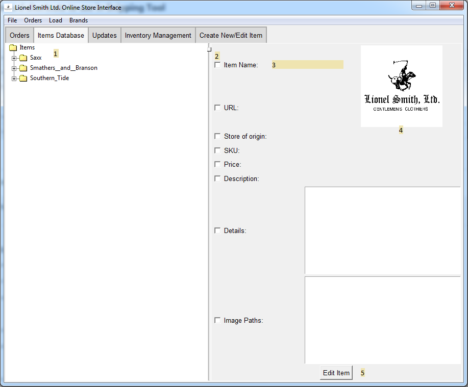

# Database Page

1. **Item Tree**

    This tree displays all of the items currently stored in the offline data, sorted by origin store,
    simply double-click an item to display its information
    
2. **Size Bar**

    This bar allows for repositioning so the best view possible can be achieved on an item-to-item basis
    
3. **Item Information**

    In these fields all of the information of an item will appear, checkboxes are a 
    semi-deprecated feature
    
4. **Item Image**

    Brings up what is essentially the default image for the item
    
5. **Edit Item Button**

    Opens this item in the Edit/Create Item Window for editing