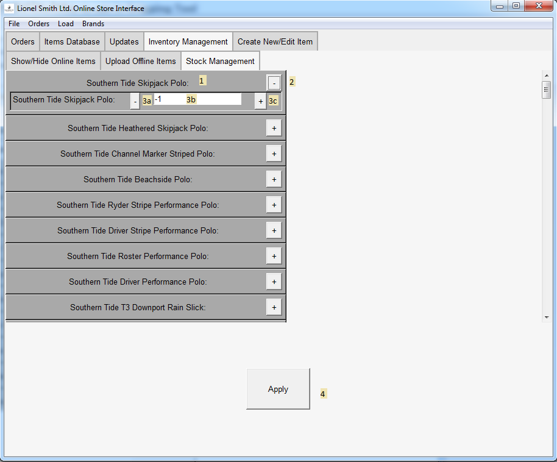
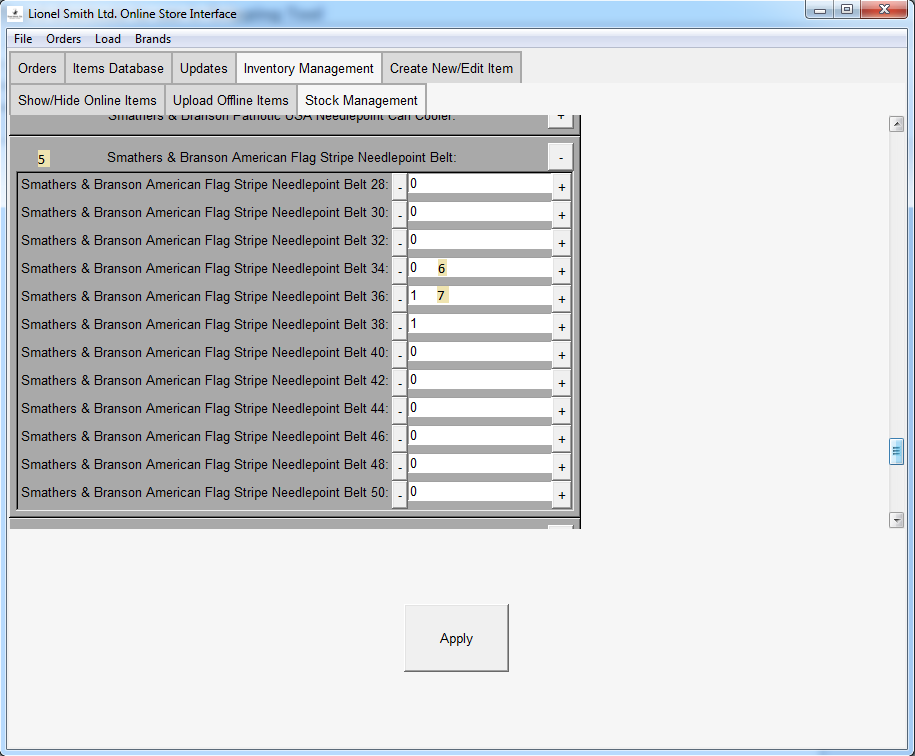

# Stock Management Page

## Rows

1. Title

    Title of the item whose stock is being changed
    
2. Expand/Contract Button

    This button opens and closes an item for editing, in the image,
    only the top item is expanded while the others are closed
    
3. Inner Components

    a. Decrement Item Stock button (note that -1 translates to unlimited stock)
    
    b. Stock Amount (Entry field, can be entered manually or via buttons)
    
    c. Increment Stock Amount
    
4. Apply Button
    
    Applies changes made to the stocks in the online store

## Inner Data

For some items, stocks of individual sizes also need to be accounted for, so lists are also used for these items within each row

5. Inner list of the different sizes of item in the online store

6. An example of an out-of-stock size of item

7. An example of an in-stock size of item
