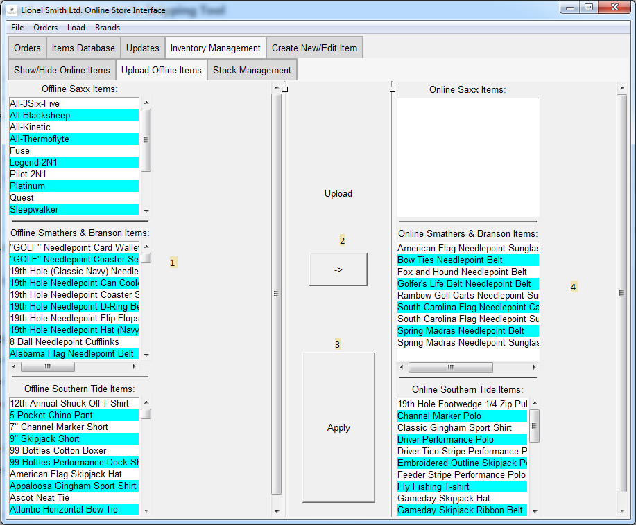

# Upload Items Page

Manages uploading items stored locally that are not yet on the
online store.

1. Offline Items

    This column shows a list of items for each brand in the store that 
    are not currently uploaded to the online storefront.
    
2. Upload Button

    This button allows a user to move 1 item at a time from the left list
    to the right one, setting up that item for upload during the next
    update call.
    
3. Apply Button

    Saves the changes made to the items thus far, and will actually 
    upload new items.
    
4. Online Items

    This columns shows lists of all items currently uploaded to the 
    online storefront.