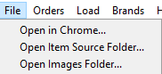
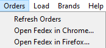
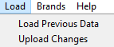
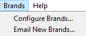
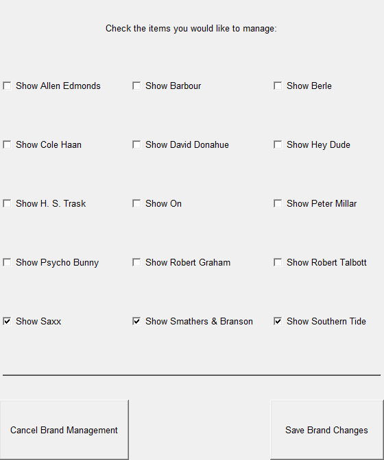
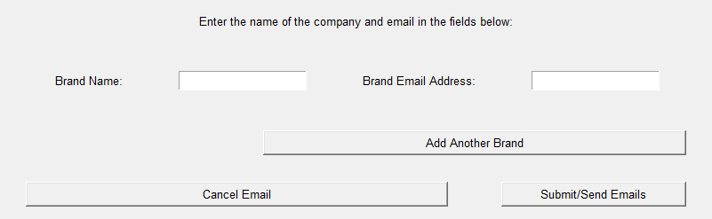
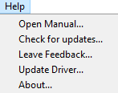

# Menus

## File Menu

- Open in Chrome...
    - Opens the Squarespace page for the store in Chrome
- Open Item Source Folder...
    - Opens the source folder of where the items are stored (location of items.json)
- Open Images Folder...
    - Opens the source folder of where the images are stored (location of all item images)
    
## Orders Menu
    

- Refresh Orders
    - This brings up a restart dialog, as it restarts the application to refresh the orders displayed
- Open Fedex in Chrome...
    - Opens the page for shipping a package using Chrome
- Open Fedex in Firefox...
    - Opens the page for shipping a package using Firefox
    
## Load Menu

- Load Previous Data
    - Provided in case of data corruption, reverses any changes made programatically in this session and restores original data state
- Upload Changes
    - Executes the background process of changing all data indicated in the UI (uploads, updates, deletions, etc.)
    
## Brands Menu

- Configure Brands...

    - Brings up a dialog to select brands to manage in the store, used when removing past brands or adding new ones to the interface
- Email New Brands...

    - Brings up a dialog of information to enter to automatically send an email to a specified company to request permission to use items and item images on our website
    
## Help Menu

- Open Manual...
    - Opens base page for this site
- Check for updates...
    - Checks data for updates as compared to current data
- Leave feedback...
    - Composes an email to send to the creator
- Update Driver...
    - Updates chromedriver if necessary, should be done automatically but this is manual backup of sorts (experimental/incomplete)
- About...
    - Brings up a simple information page about the current version of this project 
