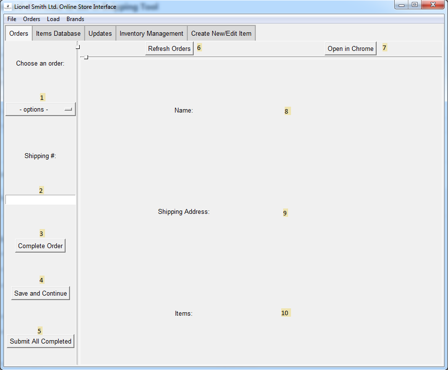

# Base Page (Orders)

1. **Orders Dropdown**

    As the name implies, this dropdown shows a list of orders, click an order to change the relevant information on the current page
    
2. **Shipping Number Input**

    Input a shipping number here, this will be saved after pressing Save and Continue for the first time,
    this will not be allowed unless a valid tracking number is given
    
3. **Complete Order Button**

    This can button marks the Order for completion, must be able to save the item to use this button
    
4. **Save and Continue Button**

    Performs as expected, will change text to "Input Valid Shipping Number" if the one in the box is not valid,
    it should still save but the order will not be able to be completed until a valid shipping number is saved
    
5. **Submit All Completed Button**

    Performs the operation of submitting all of the information entered in the previous steps
    on the website itself, will only run valid orders. Note that the dropdown box will not update
    until the app restarts
    
6. **Refresh Orders Button**

    Refreshes Orders via the only method currently available: an application restart
    
7. **Open in Chrome**

    This button opens the page being manipulated in the Chrome Browser
    
8. **Name field**

    This field displays the current orders Customer's name
    
9. **Shipping Address field**

    This field displays the address the order is being shipped to
    
10. **Items field**

    This field displays all of the items in the order, including color, name, price, etc.