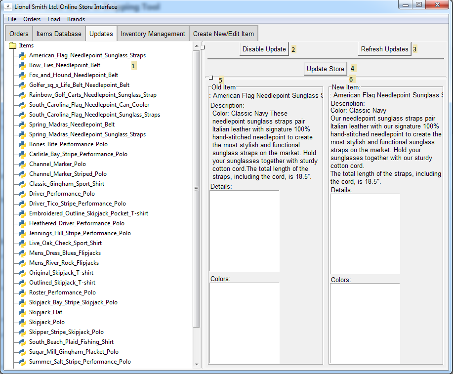

# Updates Page

1. **Updating Items**

    The list of items which have perceived updates from their 
    current data
    
2. **Disable Update**

    Marks this item to not be updated until specified otherwise,
    good for freezing item information
    
3. **Refresh Updates**

    Brings up a dialog to confirm restart because that's the
    only main way to check for such
    
4. **Update Store**

    A shortcut to the interface to update the store with what is
    shown here. Note that changes in other windows that have been
    properly saved will also be executedd when this button is 
    pressed
    
5. **Old Item Information**

    What the current item online has in its information fields.
    Note that this may often just be a matter of formatting, and 
    in those cases you may disregard these changes, as the 
    final result will be correct
    
6. **New Item Information**

    Information that has recently been acquired and may need to 
    replace the current data. See note above for any confusing 
    conflicts.